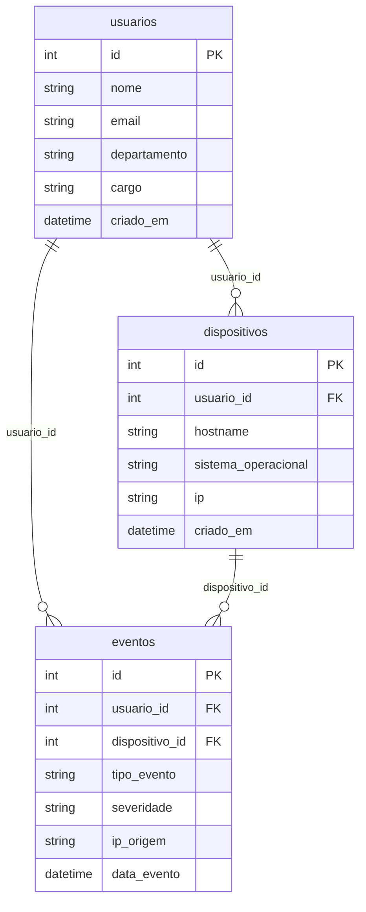

# 🛡️ DataOps Agent: Cibersegurança & Auditoria de Dados

> Assistente autônomo de DataOps e segurança da informação baseado em arquitetura **SQLite + Model Context Protocol (MCP) + Agente ReAct + Guardrails de Leitura + Streamlit**.

---

## 👥 Integrantes do Trio
* **Mateus Huster**
* **Deric Gabriel**
* **Leonardo Wingert**

---

## 📌 Visão Geral do Projeto

O **DataOps Agent** atua como um auditor contínuo da integridade e segurança de bases de dados relacionais corporativas. Utilizando técnicas de **Schema Grounding**, o agente inspeciona o catálogo relacional antes de formular qualquer consulta SQL, prevenindo alucinações de tabelas ou colunas inexistentes e auto-recuperando-se diante de falhas de sintaxe ou schema.

### 🏛️ Arquitetura do Sistema
```
┌────────────────────────────────────────────────────────┐
│                   Streamlit UI (app.py)                │
└──────────────────────────┬─────────────────────────────┘
                           │ stdio / JSON-RPC
┌──────────────────────────▼─────────────────────────────┐
│                 DataOpsAgent (ReAct Loop)              │
│          Google Gemini SDK + Auto-Recuperação          │
└──────────────────────────┬─────────────────────────────┘
                           │
┌──────────────────────────▼─────────────────────────────┐
│              Guardrails de Segurança SQL               │
│      (Validação Lexical, Whitelist SELECT/WITH)        │
└──────────────────────────┬─────────────────────────────┘
                           │
┌──────────────────────────▼─────────────────────────────┐
│              Servidor MCP (FastMCP Local)              │
│       schema_tools • profiling_tools • query_tools     │
└──────────────────────────┬─────────────────────────────┘
                           │ SQLite Driver (mode=ro)
┌──────────────────────────▼─────────────────────────────┐
│             Banco SQLite (data/dataops.db)             │
│            usuarios • dispositivos • eventos           │
└────────────────────────────────────────────────────────┘
```

---

## 🗄️ Modelo Relacional de Dados (Cibersegurança)

O banco de dados relacional é mantido localmente em `data/dataops.db` e contém 3 entidades conectadas por chaves estrangeiras:



Para a documentação completa dos campos, restrições e perguntas de negócio, consulte o [Dicionário de Dados](docs/dicionario_dados.md).

---

## ⚙️ Variáveis de Ambiente

Crie um arquivo `.env` na raiz do projeto a partir do modelo [.env.example](.env.example):

```bash
cp .env.example .env
```

Edite o arquivo `.env` com as suas credenciais:

```env
# Chave da API do Google Gemini (Obrigatória)
GEMINI_API_KEY="AIzaSy..."

# Modelo do Gemini a ser utilizado (Opcional - padrão: gemini-3.5-flash-lite)
GEMINI_MODEL="gemini-3.5-flash-lite"
```

> ⚠️ **Atenção:** O arquivo `.env` contém credenciais e **nunca** deve ser versionado no Git. Ele já está devidamente listado no `.gitignore`.

---

## 🚀 Instalação e Execução

### 1. Clonar o repositório
```bash
git clone https://github.com/<seu-usuario>/DataOps-Agent_Ciberseguranca.git
cd DataOps-Agent_Ciberseguranca
```

### 2. Criar e ativar o ambiente virtual
```bash
python3 -m venv .venv
source .venv/bin/activate
```

### 3. Instalar as dependências
```bash
pip install -r requirements.txt
```

### 4. Inicializar e popular a base SQLite
Gera o banco `data/dataops.db` com dados determinísticos e anomalias controladas para auditoria:
```bash
python src/database/init_db.py
python src/database/seed_data.py
```

### 5. Executar os Testes Automatizados
Antes de subir a aplicação, valide o banco e os módulos de segurança:

```bash
# Smoke test do banco e das anomalias
python tests/smoke_test_db.py

# Bateria de ataques e testes dos guardrails
python tests/test_guardrails_attacks.py

# Teste demonstrativo de auto-recuperação (gera trace_auto_recuperacao.json)
python tests/teste_auto_recuperacao.py
```

### 6. Executar a Interface Streamlit
Inicie a interface web do assistente:
```bash
streamlit run app.py
```
Acesse a aplicação no seu navegador em: **`http://localhost:8501`**

---

## 🖥️ Capturas de Tela da Aplicação

### 1. Interface Minimalista & Barra Lateral
A interface conta com layout limpo e moderno, sidebar com indicadores de saúde da base SQLite (tags coloridas para o banco e tabelas) e sugestões rápidas de auditoria (`st.pills`):


*(Salve as capturas de tela da aplicação em `docs/screenshot_app.png`)*

### 2. Auto-Gráficos Analíticos
Quando uma consulta retorna dados categóricos agregados (ex: eventos por severidade ou por departamento), o assistente gera automaticamente visualizações gráficas minimalistas acompanhadas da tabela de dados:


### 3. Rastro de Auditoria (Tool Calling Trace)
O usuário pode expandir o rastro completo de ferramentas para auditar a query SQL executada, validação dos guardrails e tempo de resposta em milissegundos:


---

## 🛡️ Políticas de Segurança & Guardrails

O agente implementa o princípio da **Defesa em Profundidade**:
1. **Conexão SQLite Read-Only:** Todas as consultas do executor rodam com `file:data/dataops.db?mode=ro`, bloqueando qualquer escrita no nível de sistema de arquivos.
2. **Whitelist de Comandos:** Apenas consultas iniciadas por `SELECT` ou `WITH` são autorizadas.
3. **Blacklist Rigorosa:** Bloqueio imediato de palavras perigosas (`DROP`, `DELETE`, `UPDATE`, `INSERT`, `ALTER`, `ATTACH`, `PRAGMA`, etc.).
4. **Anti-Evasão:** Remoção de literais entre aspas, bloqueio de comentários SQL (`--`, `/* */`) e proibição de múltiplos statements com `;`.
5. **Paginação Forçada:** Injeção e garantia mandatória de `LIMIT 50`.

Para uma lista completa de perguntas para testar gráficos e guardrails, consulte [perguntas.txt](perguntas.txt).

---

## 👥 Escala de Trabalho do Trio

| Dia | Foco do Encontro | Piloto (Teclado) | Copilotos |
|---|---|---|---|
| **Dia 16** | Kickoff, Modelagem SQLite, DDL & Seed | Leonardo Wingert | Mateus Huster, Deric Gabriel |
| **Dia 17** | Ferramentas de Schema, Profiling & Queries | Mateus Huster | Leonardo Wingert, Deric Gabriel |
| **Dia 18** | Guardrails de Segurança & Servidor MCP | Deric Gabriel | Mateus Huster, Leonardo Wingert |
| **Dia 19** | Loop ReAct, Auto-recuperação & Streamlit | Leonardo Wingert | Mateus Huster, Deric Gabriel |
| **Dia 20** | Validação Final, Demo Day & Pitch | Todos | Todos |

---

## 📜 Licença

Projeto desenvolvido para fins educacionais no âmbito do programa DataOps / AI Agents.